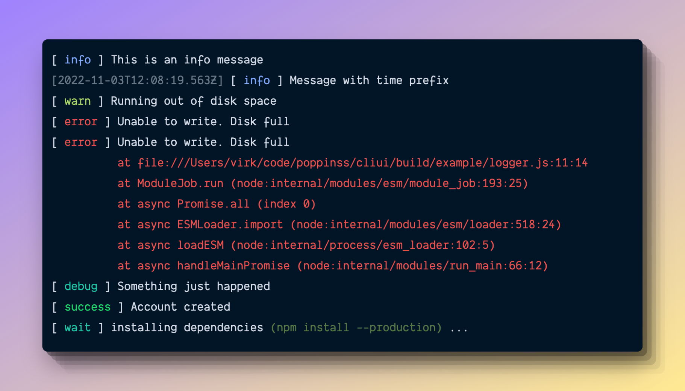
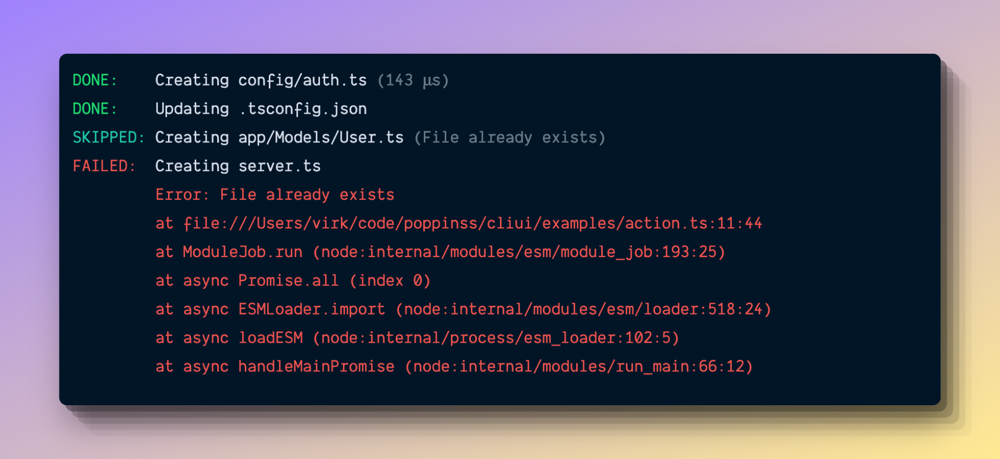
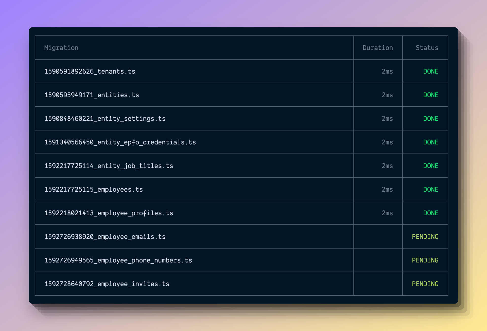
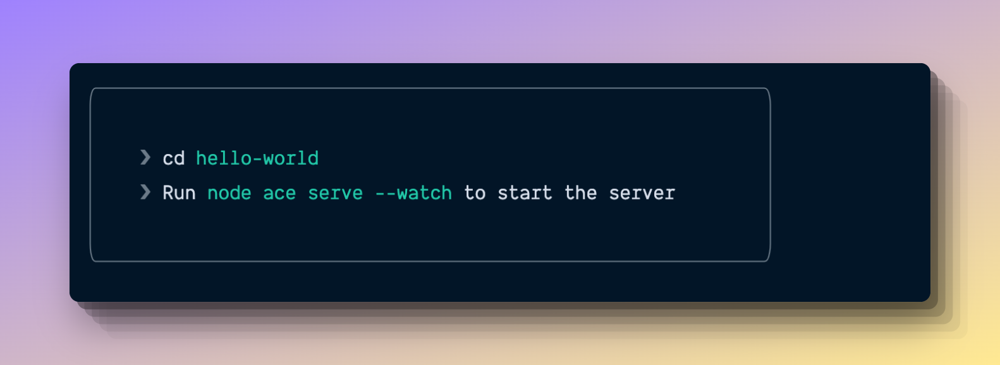
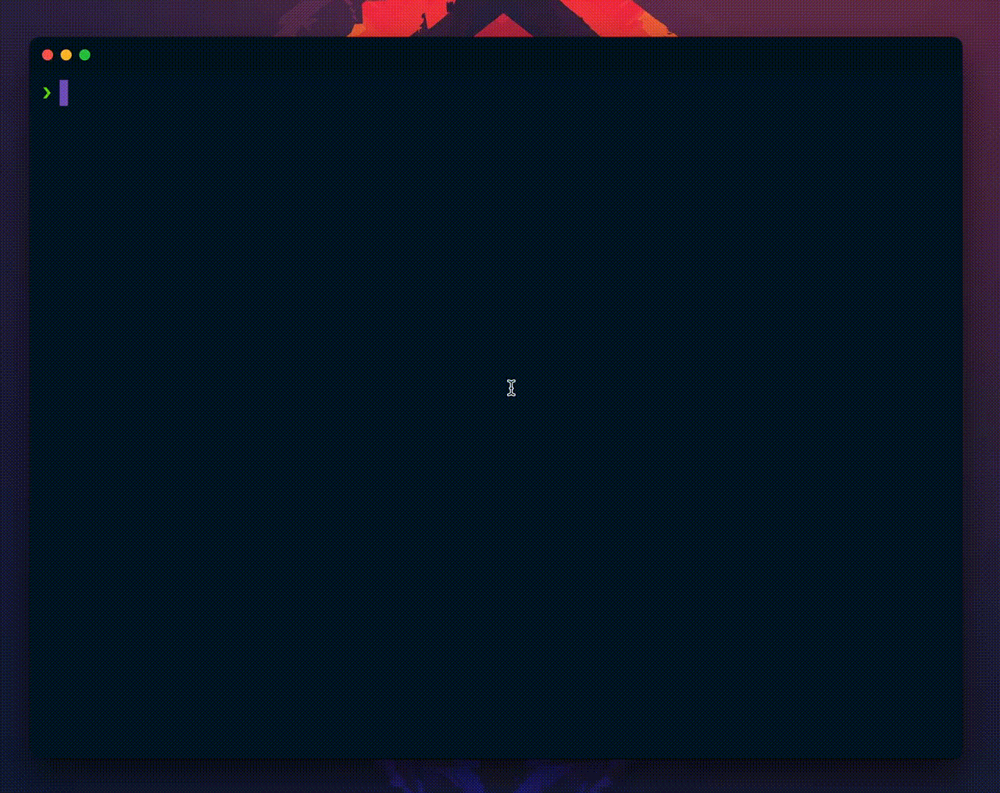
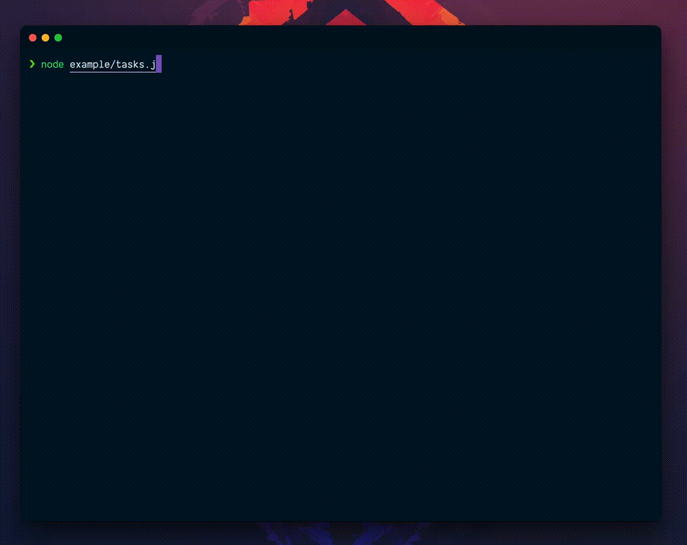

# @poppinss/cliui
> Opinionated UI KIT for Command Line apps

[![gh-workflow-image]][gh-workflow-url] [![typescript-image]][typescript-url] [![npm-image]][npm-url] [![license-image]][license-url]

## Why this package exists?
CLI UI is an opinionated UI Kit to **log messages**, **render tables**, **display spinners**, and much more. Following are some of the reasons for creating this package.

- First-class support for testing the UI kit output.
- Using a standard set of design elements without allowing them to be configurable. Choosing consistency over configurability.

## Basic usage
Install the package from the npm registry as follows:

```sh
npm i @poppinss/cliui

# yarn lovers
yarn add @poppinss/cliui
```

Import the `cliui` and create an instance of it.

```ts
import { cliui } from '@poppinss/cliui'
const ui = cliui()

ui.logger.info('This is an info message')
// [ info ] This is an info message
```

Now, let's say you are testing a command and want to assert that an info message is logged during the command's execution.

Usually, you will have to hack into the `process.stdout` stream and collect messages within memory (for assertion) and strip any colors (aka ansi sequences) from the output.

However, with this package, you can turn on the `raw` mode to collect the logger messages within memory and turn off all color transformations.

```ts
// RAW MODE ON
const ui = cliui({ raw: true })

ui.logger.info('This is an info message')

const logs = ui.logger.getRenderer().getLogs()
assert.deepEqual(logs, [
  {
    stream: 'stdout',
    message: '[ cyan(info) ] This is an info message'
  }
])
```

Similarly, you can assert that an error message is logged to `stderr`.

```ts
const ui = cliui({ raw: true })

ui.logger.error('Something went wrong')

const logs = ui.logger.getRenderer().getLogs()
assert.deepEqual(logs, [
  {
    stream: 'stderr',
    message: '[ red(error) ] Something went wrong'
  }
])
```

## Logger
The logger displays all the log messages with consistent styling. Following are the available logging methods.



```ts
import { cliui } from '@poppinss/cliui'
const ui = cliui()

// Writes to stdout
logger.debug('Something just happened')
logger.info('This is an info message')
logger.success('Account created')
logger.warning('Running out of disk space')

// Writes to stderr
logger.error(new Error('Unable to write. Disk full'))
logger.fatal(new Error('Unable to write. Disk full'))
```

You can also define the `prefix` and `suffix` for the log message. The prefix and suffix are displayed with lower opacity (the dim color transformation is used).

```ts
logger.info('Install packages', { suffix: 'npm i --production' })
```

You can display current time as a prefix using the `%time%` keyword.

```ts
logger.info('Message with time prefix', { prefix: '%time%' })
```

### Loading animation
You can display a log message with a loading animation using the `logger.await` method. The method accepts the initial message to display alongside an optional `prefix` or `suffix`.

```ts
const loader = logger.await('installing packages', { suffix: 'npm i' })

// Start animation
loader.start()

// Update the message
loader.update('unpacking packages', { suffix: undefined })

// Stop loader
loader.stop()
```

### Spinner in silent mode
If you writing conditionals around the spinning animation to start it in certain conditions, then you might want to create the spinner in silent mode. In silent mode, the spinner will not output any logs.

```ts
const loader = logger.await('installing packages', {
  suffix: 'npm i',
  silent: true // 👈
})

// Prints nothing
loader.start()

// Prints nothing
loader.update('unpacking packages', { suffix: undefined })

// Prints nothing
loader.stop()
```

### Preparing messages without writing them
You can also use the logger to just prepare the message (with colors and formatting) without writing it to the output stream. Just prefix the log message with `prepare` and it will return a string value.

```ts
const debugMessage = logger.prepareDebug('Something just happened')
const infoMessage = logger.prepareInfo('This is an info message')
const successMessage = logger.prepareSuccess('Account created')
const warningMessage = logger.prepareWarning('Running out of disk space')
```

### Testing logger output
First, you must instantiate the `cliui` in raw mode to collect all logs messages within memory. And then you can access the logs using `logger.getRenderer()` to write assertions.

```ts
const ui = cliui({ raw: true })

ui.logger.info('Hello world')

const logs = ui.logger.getRenderer().getLogs()
console.log(logs)
```

## Logger actions
Logger actions are pre-styled logs to display the outcome of an action. For example, the action can be to create/update or delete a file. 



You can create an action by calling the `logger.action` method and pass the message to display. Once, done perfoming the underlying operation, you can either mark the action as `succeeded`, `skipped`, or `failed`.

```ts
logger
  .action('Creating config/auth.ts')
  .displayDuration()
  .succeeded()

logger
  .action('Updating .tsconfig.json')
  .succeeded()

logger
  .action('Creating app/Models/User.ts')
  .skipped('File already exists')

logger
  .action('Creating server.ts')
  .failed(new Error('File already exists'))
```

## Table
You can create a table using the `ui.table` method. Under the hood, we are using [cli-table3](https://www.npmjs.com/package/cli-table3) but only expose some of its configuration options for consistency.



```ts
const ui = cliui()
const table = ui.table()

table
  .head([
    'Migration',
    'Duration',
    'Status',
  ])
  .row([
    '1590591892626_tenants.ts',
    '2ms',
    'DONE'
  ])
  .row([
    '1590595949171_entities.ts',
    '2ms',
    'DONE'
  ])
  .render()
```

You can apply color transforms to any value when rendering the table. For example:

```ts
table.row([
  '1590595949171_entities.ts',
  '2',
  ui.colors.green('DONE')
])
```

### Right-align columns
You can right-align the columns by defining them as objects and using the `hAlign` property. Also, make sure to align the header column right as well.

```ts
table
  .head([
    'Migration',
    'Batch'
    {
      content: 'Status',
      hAlign: 'right'
    },
  ])

table.row([
  '1590595949171_entities.ts',
  '2',
  {
    content: ui.colors.green('DONE'),
    hAlign: 'right'
  }
])
```

### Render full width
You can render tables in full width (taking all the space of the terminal) by calling the `table.fullWidth` method. In full-width mode:

- We will render all columns as per the size of the content.
- Except for the first column, which takes all the available space.

```ts
table.fullWidth()
```

You can also change the column index for the fluid column (the one that takes all the space) by calling the `table.fluidColumnIndex` method.

```ts
table
  .fullWidth()
  .fluidColumnIndex(1)
```

### Testing table output
First, you must instantiate the `cliui` in raw mode to collect all logs messages within memory. And then you can access the table output using `logger.getRenderer()` to write assertions.

```ts
const ui = cliui({ raw: true })
const table = ui.table()

table
  .head(['Migration','Duration', 'Status'])
  .row([ '1590591892626_tenants.ts', '2ms', 'DONE'])
  .render()

const logs = table.getRenderer().getLogs()
console.log(logs)
```

## Instructions
The instructions widget allows you to render a box with steps. Each step gets prefixed with an arrow `>`.



```ts
const ui = cliui()
const instructions = ui.instructions()

instructions
  .add(`cd ${colors.cyan('hello-world')}`)
  .add(`Run ${colors.cyan('node ace serve --watch')} to start the server`)
  .render()
```

## Sticker
The sticker widget is the same as the `instructions` widget. But it does not prefix each line with an arrow `>`.


```ts
const ui = cliui()
const sticker = ui.sticker()

sticker
  .add('Started HTTP server')
  .add('')
  .add(`Local address:    ${colors.cyan('http://localhost:3333')}`)
  .add(`Network address:  ${colors.cyan('http://192.168.1.2:3333')}`)
  .render()
```

### Testing instructions and sticker output
First, you must instantiate the `cliui` in raw mode to collect all logs messages within memory. And then you can access the instructions/sticker output using `logger.getRenderer()` to write assertions.

```ts
const ui = cliui({ raw: true })
const instructions = ui.instructions()

instructions
  .add(`cd ${colors.cyan('hello-world')}`)
  .add(`Run ${colors.cyan('node ace serve --watch')} to start the server`)
  .render()

const logs = instructions.getRenderer().getLogs()
console.log(logs)
```

## Tasks
The tasks widget allows rendering a list of tasks to perform. Each task has an associated async callback to **perform the task**, **report its progress**, and also **mark it as succeeded or failed**.



- The return value of the callback function is used as the success message.
- You can throw an Error to mark the task as failed. Or, call the `task.error` method to prepare an error from a string value.

```ts
const ui = cliui()
const tasks = ui.tasks()

await tasks
  .add('clone repo', async (task) => {
    return 'Completed'
  })
  .add('update package file', async (task) => {
    return task.error('Unable to update package file')
  })
  .add('install dependencies', async (task) => {
    return 'Installed'
  })
  .run()
```

### Reporting task progress
Instead of writing the task progress messages to the console directly, you recommend you call the `task.update` method. 

The method ensures to display of the latest log message only when using the `minimal` renderer and logs all messages when using the `verbose` renderer.

```ts
const sleep = () => new Promise<void>((resolve) => setTimeout(resolve, 50))

tasks
  .add('clone repo', async (task) => {
    for (let i = 0; i <= 100; i = i + 2) {
      await sleep()
      task.update(`Downloaded ${i}%`)
    }

    return 'Completed'
  })
```

### Using verbose renderer
The `verbose` renderer displays all the log messages instead of just the latest one. Also, the task output is rendered differently from the minimal renderer. Please, check the [example](./example/tasks.ts) file for the same.



You can create the tasks instance with a `verbose` renderer as follows. The rest of the API is the same.

```ts
const tasks = ui.tasks({ verbose: true })
```

### Testing tasks output
First, you must instantiate the `cliui` in raw mode to collect all logs messages within memory. And then you can access the tasks output using `logger.getRenderer()` to write assertions.

```ts
const ui = cliui({ raw: true })
const tasks = ui.tasks()

await tasks
  .add('clone repo', async (task) => {
    return 'Completed'
  })
  .add('update package file', async (task) => {
    return task.error('Unable to update package file')
  })
  .add('install dependencies', async (task) => {
    return 'Installed'
  })
  .run()

const logs = tasks.getRenderer().getLogs()
console.log(logs)
```

[gh-workflow-image]: https://img.shields.io/github/actions/workflow/status/poppinss/cliui/checks.yml?style=for-the-badge
[gh-workflow-url]: https://github.com/poppinss/cliui/actions/workflows/checks.yml "Github action"

[typescript-image]: https://img.shields.io/badge/Typescript-294E80.svg?style=for-the-badge&logo=typescript
[typescript-url]: "typescript"

[npm-image]: https://img.shields.io/npm/v/@poppinss/cliui.svg?style=for-the-badge&logo=npm
[npm-url]: https://npmjs.org/package/@poppinss/cliui 'npm'

[license-image]: https://img.shields.io/npm/l/@poppinss/cliui?color=blueviolet&style=for-the-badge
[license-url]: LICENSE.md 'license'
